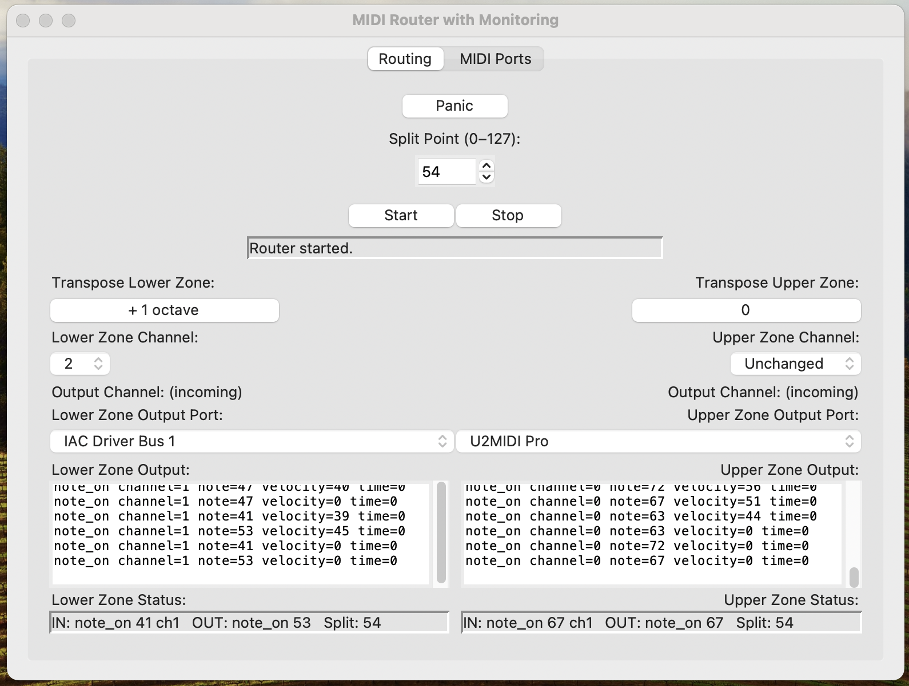

# SimpleMIDISplitChannelModifier

A clean, Python-based MIDI split‑point channel‑modifying monitor/router designed for live performance, experimentation, and reliable routing between MIDI devices.



---

# Quick Start (Windows, macOS, Linux)

1. Download the project  
You may either clone the repository:

```
git clone https://github.com/johntynan/SimpleMIDISplitChannelModifier.git
cd SimpleMIDISplitChannelModifier
```

Or download the ZIP from GitHub, extract it, and open a terminal or command prompt inside the extracted folder.

2. Create a virtual environment (recommended)

Windows:
```
python -m venv .venv
.venv\Scripts\activate
```

macOS / Linux:
```
python3 -m venv .venv
source .venv/bin/activate
```

3. Install dependencies
```
pip install mido python-rtmidi
```

4. Run the application

Windows:
```
python MidiModifier.py
```

macOS / Linux:
```
python3 MidiModifier.py
```

Or on macOS/Linux you may use the helper script:
```
chmod +x run_midimodifier.sh
./run_midimodifier.sh
```

Once launched, select your MIDI ports, set your split point, and begin routing.

---

# Overview

SimpleMIDISplitChannelModifier is a lightweight, cross‑platform MIDI router that provides:

- A configurable split point for dividing the keyboard into zones
- Independent routing for Lower and Upper zones
- Per‑zone channel remapping
- Real‑time Incoming and Outgoing MIDI monitoring
- Safe fallback behavior when no ports are selected
- A thread‑safe routing loop for stable live performance
- Compatibility with Windows, macOS, and Linux using Python, mido, and python‑rtmidi

Main script: `MidiModifier.py`  
Helper script (Unix-like systems): `run_midimodifier.sh`

---

# Features

Four-tab interface:
- Routing: split point, zone routing, channel remapping
- Incoming: real-time view of incoming MIDI messages
- Outgoing: real-time view of routed/modified messages
- MIDI Ports: explicit input/output port selection

Split-point routing:
- Adjustable split point at the top of the Routing tab
- Lower and Upper zones defined relative to the split point
- Each zone can keep the original channel or remap to a new one

Port selection:
- Exact ALSA/MIDO port selection
- Safe fallback when no ports are selected
- Works with hardware MIDI devices and virtual ports (loopMIDI, IAC Driver, ALSA virtual ports, etc.)

Thread-safe routing loop:
- Stable under continuous live MIDI input
- Designed for performance and reliability

---

# Requirements

- Python 3.8 or newer
- Python packages: `mido`, `python-rtmidi`
- At least one MIDI input and output device (hardware or virtual)

---

# Getting the Code

Clone the repository:
```
git clone https://github.com/johntynan/SimpleMIDISplitChannelModifier.git
cd SimpleMIDISplitChannelModifier
```

Or download ZIP:
1. Visit the GitHub repository
2. Select Code → Download ZIP
3. Extract the ZIP
4. Open a terminal or command prompt inside the extracted folder

---

# Setting Up the Python Environment

Create a virtual environment:

Windows:
```
python -m venv .venv
.venv\Scripts\activate
```

macOS / Linux:
```
python3 -m venv .venv
source .venv/bin/activate
```

Install dependencies:

If a requirements.txt exists:
```
pip install -r requirements.txt
```

Otherwise:
```
pip install mido python-rtmidi
```

---

# Running the Application

## Windows

1. Open Command Prompt or PowerShell
2. Navigate to the project folder:
```
cd path\to\SimpleMIDISplitChannelModifier
```
3. Activate the virtual environment:
```
.venv\Scripts\activate
```
4. Run the application:
```
python MidiModifier.py
```

If python does not work, try:
```
py MidiModifier.py
```

---

## macOS

1. Open Terminal
2. Navigate to the project folder:
```
cd /path/to/SimpleMIDISplitChannelModifier
```
3. Activate the virtual environment:
```
source .venv/bin/activate
```
4. Run the application:
```
python3 MidiModifier.py
```

---

## Linux

Option 1: Run directly
```
cd /path/to/SimpleMIDISplitChannelModifier
source .venv/bin/activate
python3 MidiModifier.py
```

Option 2: Use the helper script

1. Ensure the script exists:
```
touch run_midimodifier.sh
```
2. Make it executable:
```
chmod +x run_midimodifier.sh
```
If needed:
```
sudo chmod +x run_midimodifier.sh
```
3. Confirm the script ends with:
```
# 7. Run your script
echo "=== Launching MidiModifier.py ==="
python3 MidiModifier.py
```
4. Run it:
```
./run_midimodifier.sh
```

---

# Basic Usage

1. Launch the application
2. Open the MIDI Ports tab and select input/output ports
3. Open the Routing tab and set your split point
4. Configure Lower and Upper zone routing
5. Use Incoming and Outgoing tabs to verify routing behavior

If no ports are selected, the application remains in a safe fallback state.

---

# Troubleshooting

No MIDI ports appear:
- Ensure your MIDI devices or virtual ports are active before launching the application.

Permission errors on macOS/Linux:
```
chmod +x run_midimodifier.sh
```
Use sudo only if necessary.

Python not found:
- Windows: ensure Python is added to PATH
- macOS/Linux: use python3 instead of python

---

# Development Notes

- Main entry point: MidiModifier.py
- Helper launcher: run_midimodifier.sh
- Core libraries: mido, python-rtmidi
- Designed for explicit routing, safe defaults, live-friendly UI, and clear monitoring of MIDI flow.
